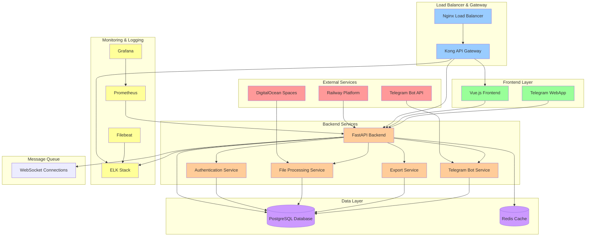
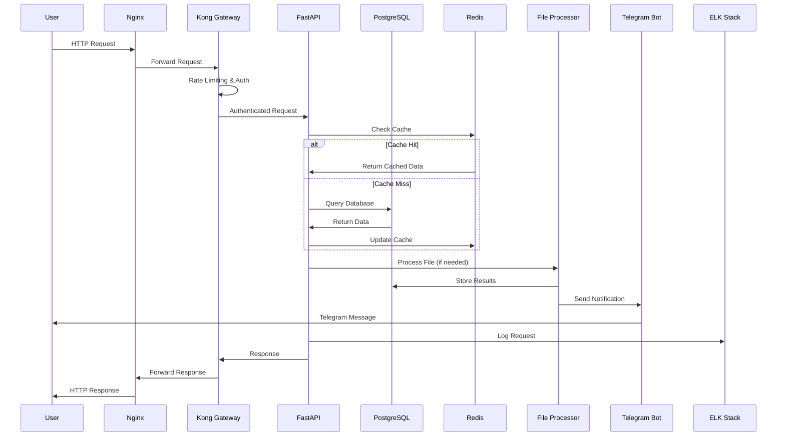
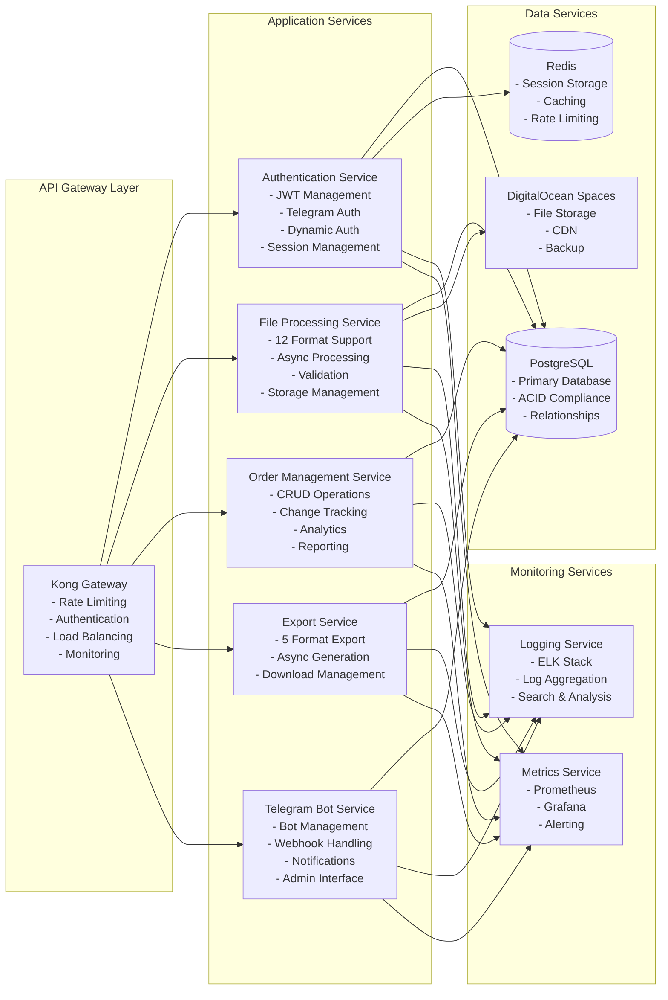
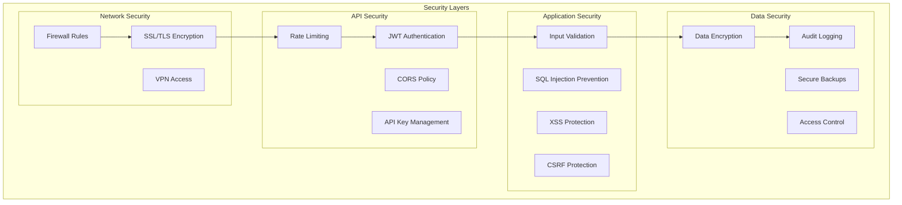
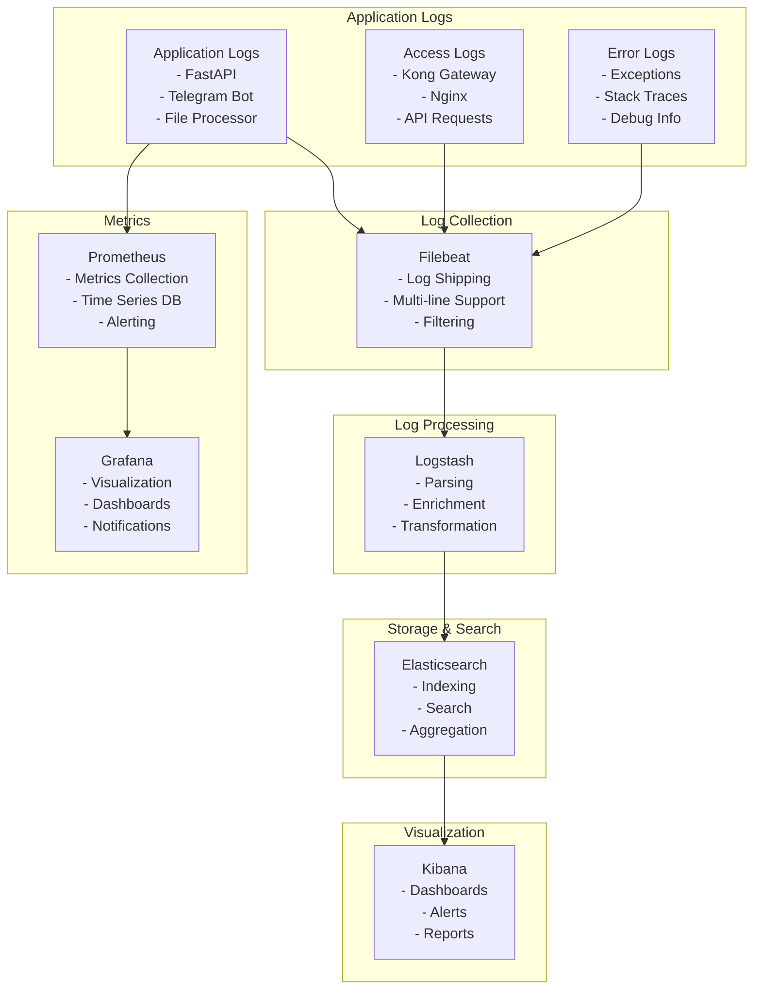
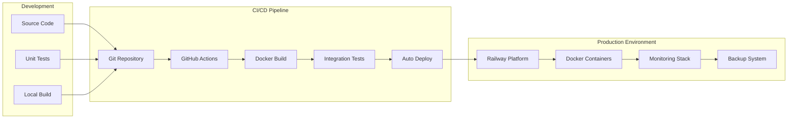
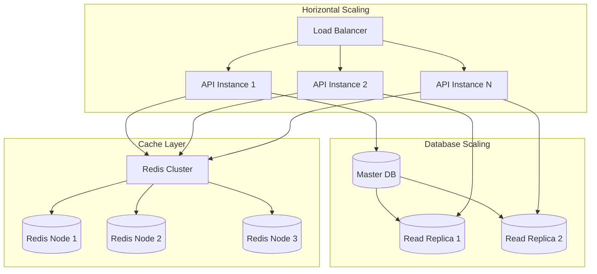

# VHM24R - Архитектура системы

## 🏗️ Общая архитектура

## 🔄 Поток данных

## 🏛️ Микросервисная архитектура

## 🔐 Безопасность

## 📊 Мониторинг и логирование

## 🚀 Развертывание

## 📈 Масштабирование

## 🔧 Технологический стек

### Backend
- **FastAPI** - Современный веб-фреймворк для Python
- **SQLAlchemy** - ORM для работы с базой данных
- **PostgreSQL** - Реляционная база данных
- **Redis** - Кэширование и сессии
- **Celery** - Асинхронные задачи (планируется)

### Frontend
- **Vue.js 3** - Прогрессивный JavaScript фреймворк
- **Vite** - Быстрый сборщик модулей
- **Tailwind CSS** - Utility-first CSS фреймворк

### Infrastructure
- **Kong** - API Gateway
- **ELK Stack** - Логирование и мониторинг
- **Prometheus + Grafana** - Метрики и визуализация
- **Docker** - Контейнеризация
- **Railway** - Облачная платформа

### External Services
- **Telegram Bot API** - Интеграция с Telegram
- **DigitalOcean Spaces** - Объектное хранилище

## 📋 Требования к системе

### Минимальные требования
- **CPU**: 2 vCPU
- **RAM**: 4 GB
- **Storage**: 20 GB SSD
- **Network**: 100 Mbps

### Рекомендуемые требования
- **CPU**: 4 vCPU
- **RAM**: 8 GB
- **Storage**: 50 GB SSD
- **Network**: 1 Gbps

### Production требования
- **CPU**: 8 vCPU
- **RAM**: 16 GB
- **Storage**: 100 GB SSD
- **Network**: 10 Gbps
- **Backup**: Ежедневное резервное копирование
- **Monitoring**: 24/7 мониторинг
